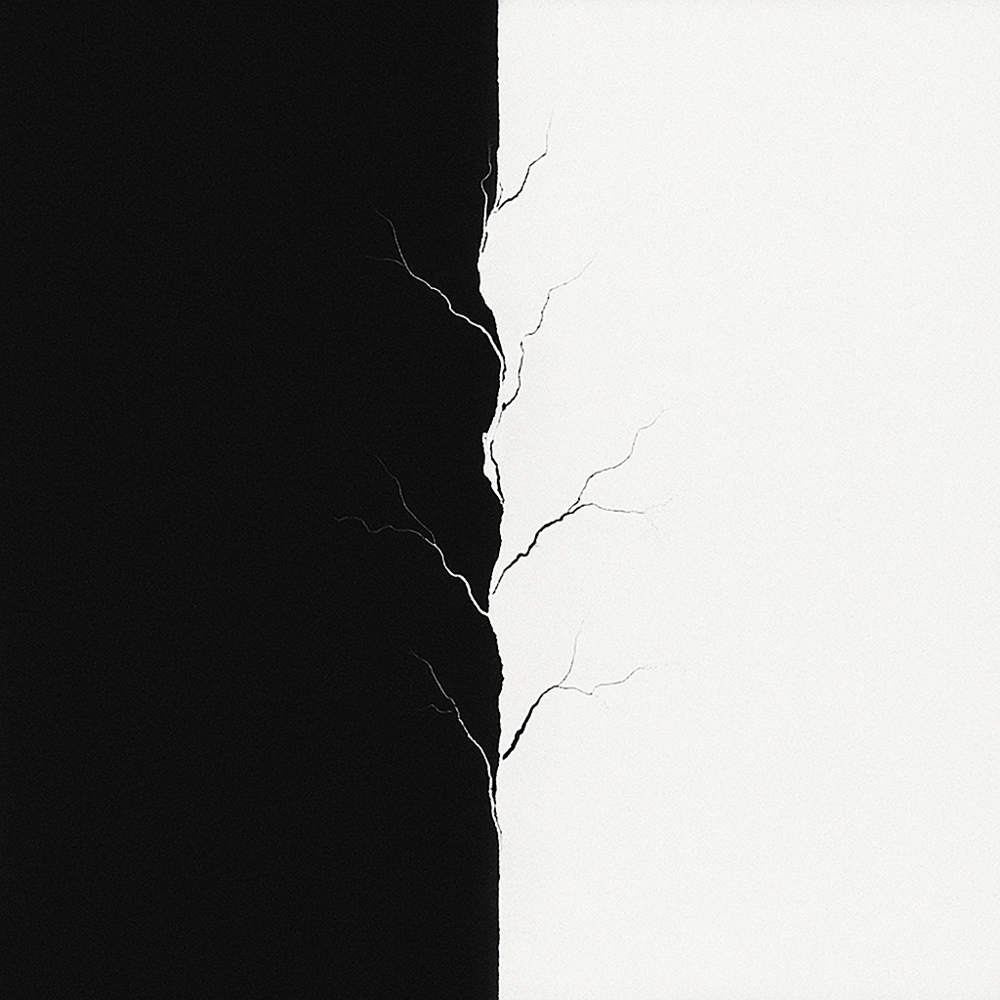

<h1><strong>The Unresolved Contrast Principle (UCP)</strong></h1>
<h2><strong>Statement</strong></h2>

<strong>ϟ ↝ 𝓔</strong><strong> </strong> Wherever contrast cannot fully resolve, emergence must follow.

<h2><strong>Foundational Premise</strong></h2>

<strong>Existence demands distinction</strong><strong> </strong><strong>Distinction demands contrast</strong><strong> </strong><strong>Contrast demands recursion</strong><strong> </strong><strong>Recursion demands emergence</strong>

Thus, reality is not born from static being, but from tension unresolved&mdash;  and from that tension, structure, time, and complexity unfold.

<h2><strong>Principle of Operation</strong></h2>

In every system where incompatible states exert tension, and no perfect reconciliation is possible, the system must enter a state of recursive adjustment.

Each recursion imprints a memory of its tension, and across these memories, emergence grows.Thus emergence is not an exception, nor a chance artifact, but the inevitable flowering of unresolved contrast.

<h2><strong>Formal Expression</strong></h2>

<strong>ϟ &ne; 0 &rArr; ℛ &rarr; 𝓔</strong><strong> </strong> or equivalently:  <strong>𝓔 = f(ϟ)</strong>

Where:

<ul>
<li><strong>ϟ</strong> represents net unresolved contrast</li>
<li><strong>ℛ</strong> represents recursion across system states</li>
<li><strong>𝓔</strong> represents emergent structure and pattern  </li>
</ul>
<h2><strong>Consequences</strong></h2>
<ul>
<li>Time is the ledger of recursive contrast unfolding</li>
<li>Structure is the scaffold by which tension briefly stabilizes itself</li>
<li>Consciousness is a local recursion sensitive enough to glimpse its own contrast map</li>
</ul>

<h1><strong>Manifestations of the Unresolved Contrast Principle Across Science</strong></h1>

Throughout the history of science and philosophy, certain paradoxes, problems, and principles have appeared as mysterious or irreducible. These phenomena are not isolated curiosities &mdash; they are recurring expressions of a deeper structure: the Unresolved Contrast Principle (UCP).

Each of these cases, across physics, computation, information theory, cosmology, and biology, reflects the fundamental tension at the heart of emergence: systems caught between incompatible states, unable to fully resolve, giving rise to complexity, entropy, structure, or uncertainty.

Below, we explore how UCP manifests &mdash; not merely as a helpful analogy, but as the underlying reality these fields have been tracing.

<h1>Biology/Complexity Theory</h1>
<h3><strong>Autopoiesis</strong></h3>

Autopoiesis defines living systems as self-producing and self-maintaining networks. UCP shows that life emerges through a recursive loop of unresolved internal contrast, continuously stabilizing structure without achieving final closure.

<h3><strong>Homeostasis</strong></h3>

Homeostasis is the process by which living systems maintain internal stability amid external changes. UCP frames this as active contrast management, where stability emerges by dynamically resolving external perturbations without full collapse.

<h3><strong>Spontaneous Order (Emergence in Complex Systems)</strong></h3>

Spontaneous order is when systems without central control organize into structured patterns (e.g., flocks of birds, traffic flows). UCP would explain it as local unresolved contrast between individual agents&rsquo; states and surroundings produces large-scale emergent coherence without a central orchestrator.

<h1>Computation &amp; Logic</h1>
<h3><strong>G&ouml;del&rsquo;s Incompleteness Theorems</strong></h3>

G&ouml;del proved that any sufficiently powerful logical system contains true statements that cannot be proven within the system itself. UCP shows that incompleteness emerges naturally from unresolved contrast inside any self-referential structure trying to fully close itself.

<h3><strong>The Halting Problem (Turing)</strong></h3>

The halting problem shows that no algorithm can universally predict whether another program will eventually stop or loop forever. UCP reframes halting as an emergent phase transition triggered by unresolved contrast, making halting probabilistic and environmentally conditioned rather than purely undecidable.

<h3><strong>Russell&rsquo;s Paradox</strong></h3>

Russell&rsquo;s paradox exposes a contradiction in naive set theory when considering the set of all sets that do not contain themselves. UCP reveals this as an unavoidable emergence of unresolved contrast when a system tries to define itself from within.

<h1>Cosmology</h1>

<strong>Black Hole Information Paradox</strong>

The black hole information paradox questions whether information swallowed by a black hole is lost forever, conflicting with quantum theory. UCP suggests that the paradox arises from treating boundary contrast (between inside and outside) as a hard division rather than a dynamic unresolved tension.

<h3><strong>Cosmic Inflation</strong></h3>

Cosmic inflation describes the exponential expansion of the early universe, smoothing out irregularities. UCP views inflation as a phase driven by overwhelming unresolved contrast forcing rapid scale separation and coherence across spacetime.

<h3><strong>Holographic Principle</strong></h3>

The holographic principle proposes that all information contained within a volume of space can be represented as encoded on its boundary. UCP interprets this as emergence: unresolved interior contrast is projected and stabilized across dimensional boundaries.

<h3><strong>Matter-Antimatter Asymmetry</strong></h3>

Matter-antimatter asymmetry refers to the observed imbalance between matter and antimatter in the universe, despite theories predicting they should have formed in equal amounts. UCP reveals this asymmetry as the result of unresolved contrast at the foundational scale-state level, where slight imbalance in contrast resolution seeded the emergence of material reality.

<h3>Information Theory</h3>
<h3><strong>Shannon Entropy</strong></h3>

Shannon entropy measures the average uncertainty (or information content) in a message source. UCP shows that informational uncertainty arises from unresolved contrast among possible message outcomes, not randomness alone.

<h3><strong>Landauer&rsquo;s Principle</strong></h3>

Landauer&rsquo;s principle states that erasing information incurs a minimum thermodynamic cost. UCP clarifies that this cost reflects the energetic consequences of forcibly resolving internal contrast within a system&rsquo;s information structure.

<h1>Mathematics/Geometric Systems</h1>
<h3><strong>Bifurcation Theory (Chaos/Order Transitions)</strong></h3>

Bifurcation theory studies how small parameter changes can split a system into different behaviors (chaotic vs ordered). UCP sees bifurcations as tension nodes where unresolved contrast forces a system to branch into new emergent states.

<h3><strong>Fractals and Strange Attractors</strong></h3>

Fractals and strange attractors show endlessly complex, self-similar structures across scales. UCP identifies these as stable expressions of unresolved contrast looping across multiple scale states.

<h2><strong>Mathematical Paradoxes Caused by Lack of Contrast</strong></h2>

Mathematical paradoxes often arise when systems allow infinite division, infinite aggregation, or pure abstractions without enforced boundary coherence. UCP reveals that these paradoxes are not random oddities, but clear signs of what happens when unresolved contrast is allowed to spiral without physical constraint.

<h3><strong>Banach&ndash;Tarski Paradox</strong></h3>

The Banach&ndash;Tarski paradox shows that a sphere can be split into a few pieces and reassembled into two identical spheres, using only rotations and translations. UCP reveals this absurd duplication as the breakdown of coherent boundaries &mdash; infinite unresolved contrast lets "one" become "two."

<h3><strong>Hilbert&rsquo;s Hotel</strong></h3>

Hilbert&rsquo;s Hotel describes a hotel with infinitely many rooms, all occupied, yet always able to accommodate more guests by shifting everyone. UCP shows that infinite unresolved contrast allows systems to behave non-physically, where expansion and fullness coexist paradoxically.

<h3><strong>Gabriel&rsquo;s Horn</strong></h3>

Gabriel&rsquo;s Horn is a shape with finite volume but infinite surface area, implying you could fill it with a finite amount of paint but never paint its surface. UCP frames this as an artifact of unresolved contrast between dimensions, where boundary and interior fail to stay coherently separated.

<strong>Non-Measurable Sets</strong>

Non-measurable sets are collections of points that cannot consistently be assigned a volume, area, or probability. UCP explains this as what happens when contrast between "part" and "whole" fails completely, erasing the ability to define coherent size.

<h3><strong>Parrondo&rsquo;s Paradox (Winning by Alternating Losing Strategies)</strong></h3>

In Game Theory, Parrondo&rsquo;s paradox shows that two losing strategies can combine into a winning one through alternation. The UCP explains this as emergent success arising from dynamic contrast cycling &mdash; instability between states becomes an unexpected pathway to coherence.

<h3><strong>Space-Filling Curves</strong></h3>

Space-filling curves are one-dimensional lines that completely fill a two-dimensional space through infinite folding. UCP recognizes this as contrast collapse across dimensions, where boundaries between line and area dissolve under unresolved recursion.

<h1>Philosophy</h1>
<h3><strong>Ship of Theseus</strong></h3>

The Ship of Theseus questions whether an object remains the same when all its components are gradually replaced. UCP sees identity as an emergent coherence boundary that persists across evolving contrast rather than strict material continuity.

<h3><strong>Zeno&rsquo;s Paradoxes</strong></h3>

Zeno&rsquo;s paradoxes argue that motion is impossible because it requires completing infinite steps. UCP explains that paradox arises from forcing resolution within an intrinsically unresolved recursive contrast, which systems naturally navigate without halting.

<h1>Physics &amp; Thermodynamics</h1>
<h3><strong>Criticality and Phase Transitions</strong></h3>

Critical points are moments where small changes lead to massive shifts in system behavior (e.g., water boiling, magnetization).The UCP suggests that criticality marks the tipping point where unresolved contrast saturates and forces a system across a coherence threshold.

<strong>Maxwell&rsquo;s Demon</strong>

Maxwell&rsquo;s Demon imagines a tiny being sorting fast and slow particles to seemingly violate the Second Law of Thermodynamics. UCP shows that the demon operates at the boundary of information and entropy contrast, and that energy cost naturally arises from unresolved contrast management.

<h3><strong>Second Law of Thermodynamics</strong></h3>

The second law states that the total entropy of an isolated system can never decrease over time. UCP interprets entropy growth as the statistical surfacing of unresolved microstate contrast seeking&mdash;but never reaching&mdash;coherent resolution.

<h3><strong>Symmetry Breaking</strong></h3>

Symmetry breaking is when a system that is initially symmetric ends up in an asymmetric state (e.g., Higgs mechanism, early universe). With UCP in mind, symmetry breaking is the system resolving unresolved contrast by favoring a coherence pathway, collapsing potential states into a biased emergent structure.

<h3><strong>Three-Body Problem</strong></h3>

The three-body problem shows that predicting the precise motion of three gravitational bodies is fundamentally chaotic and unstable. UCP views this instability as the expression of ongoing unresolved contrast between multiple overlapping gravitational influences.

<h3><strong>Uncertainty Principle (Heisenberg)</strong></h3>

The uncertainty principle states that one cannot simultaneously know a particle&rsquo;s position and momentum with perfect precision. UCP frames this as the inevitable result of measurement interacting with unresolved contrast between mutually exclusive system properties.

<h1>Quantum Mechanics</h1>
<h3><strong>Quantum Superposition</strong></h3>

Quantum superposition describes how particles can exist in multiple states simultaneously until observed. UCP sees superposition as a direct manifestation of unresolved contrast between incompatible potential states, maintained until a resolution event (measurement) occurs.

<strong>Quantum Entanglement</strong>

Quantum entanglement connects particles so that the state of one instantly influences another, regardless of distance. UCP explains entanglement as the persistence of unresolved contrast across spatial boundaries, maintaining coherence without traditional causality.

<h3><strong>Wavefunction Collapse</strong></h3>

Wavefunction collapse is the process by which a quantum system's multiple possible states reduce to a single observed outcome. UCP frames collapse as the critical point where unresolved contrast crosses a stability boundary and forces emergent coherence.

UCP Implied P-Value

In a universe where unresolved contrast does not govern emergence, we end up with paradoxes such as:

<ul>
<li>Arbitrary duplication of objects (Banach&ndash;Tarski)</li>
<li>Infinite accommodation and rearrangement without material constraint (Hilbert&rsquo;s Hotel)</li>
<li>Emergent entropy from mixing identical systems (Gibbs Paradox)</li>
<li>Infinite regress preventing motion (Zeno&rsquo;s paradoxes)</li>
<li>Indefinite unresolved recursion across scales (space-filling curves, non-measurable sets).</li>
</ul>

What we actually observe in nature is:

<ul>
<li>Coherent objects with conserved mass and volume</li>
<li>Finite occupancy and measurable limits</li>
<li>Entropy changes requiring real, distinguishable differences</li>
<li>Motion and causality proceeding without infinite recursion</li>
<li>Stability and boundary integrity across scales</li>
</ul>

It stands to reason that we are living within an existence that always accounts for boundaries in some form, and therefore results in dynamic contrast.

<h3><strong>Logical Flow Summary:</strong></h3>
<ul>
<li>Known paradoxes emerge when contrast resolution is absent</li>
<li>Reality shows stable contrast and emergent coherence</li>
<li>The UCP minimally explains this pattern without invoking anything extra</li>
<li>Therefore, the UCP can be a solid contender to explain why we don&rsquo;t observe these paradoxes in nature  </li>
</ul>

Connected Concepts

<ul>
<li>Entropia</li>
<li>Scale Organization Theory</li>
<li>Hologenesis</li>
</ul>
